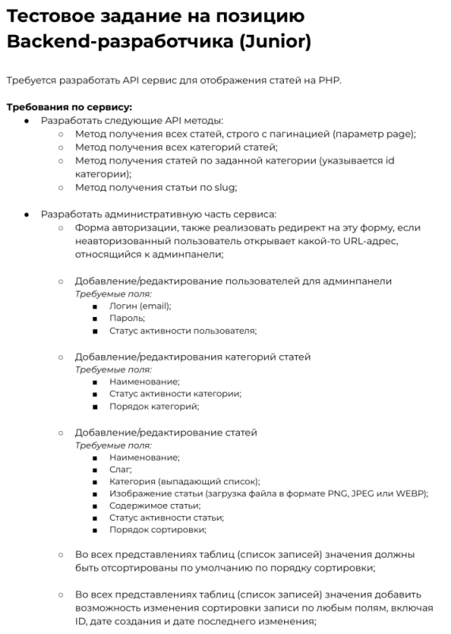
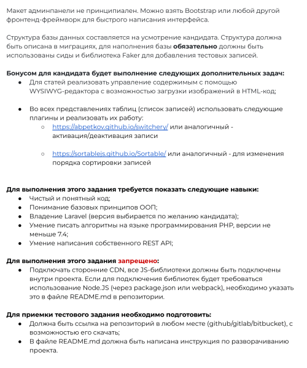

## О проекте

Данное веб-приложение было выполнено [Артёмом Похилюком](https://www.linkedin.com/in/artem-pokhiliuk/) в качестве тестового задания. Сделано полностью во фреймворке **Laravel**, с активным использованием его фронтенд-библиотеки **Livewire**.

Приложение представляет собой админ-панель, которая включает три основных модуля: управление пользователями, управление категориями статей и управление статьями. Каждый из этих модулей предоставляет удобный и интуитивно понятный интерфейс для выполнения стандартных операций CRUD (создание, чтение, обновление, удаление) с соответствующими сущностями. Также в каждом модуле предусмотрены средства сортировки записей по разным полям и возможность изменения их позиции в общем списке. Все эти операции выполняются на одной странице с помощью реактивных элементов Livewire, обеспечивая максимальное удобство и эффективность в работе. Помимо этого, реализован базовый API, отдающий статьи и категории статей.

Задание, в соответствии с которым был выполнен проект, можно найти [здесь](https://docs.google.com/document/d/1Odscti-TbxImlQo6qSe1UCfwenEk2u10ZmuXffOEkuQ/edit), либо внизу этого README в виде скриншотов.

Проект задеплоен на платформу **Railway** и доступен [по этой ссылке](https://test-articles-pokhiliuk.up.railway.app). Чтобы увидеть начинку сайта - админ-панель, нужно залогиниться под email **a@a**, пароль **a**.
 
Описание эндпойнтов API:

**server url** - https://test-articles-pokhiliuk.up.railway.app/api:

- **GET /articles** - возвращает все статьи. Доступны параметры ***page*** и ***per_page***.
- **GET /categories** - возвращает все категории. 
- **GET /articles/category/:id** - возвращает все статьи из указанной категории.
- **GET /articles/slug/:slug** - возвращает статью по указанному slug.

## Задание

